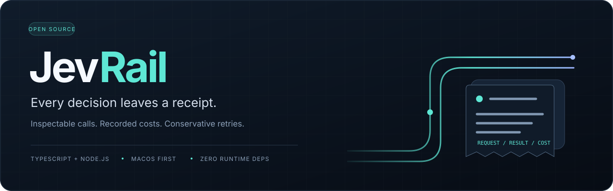
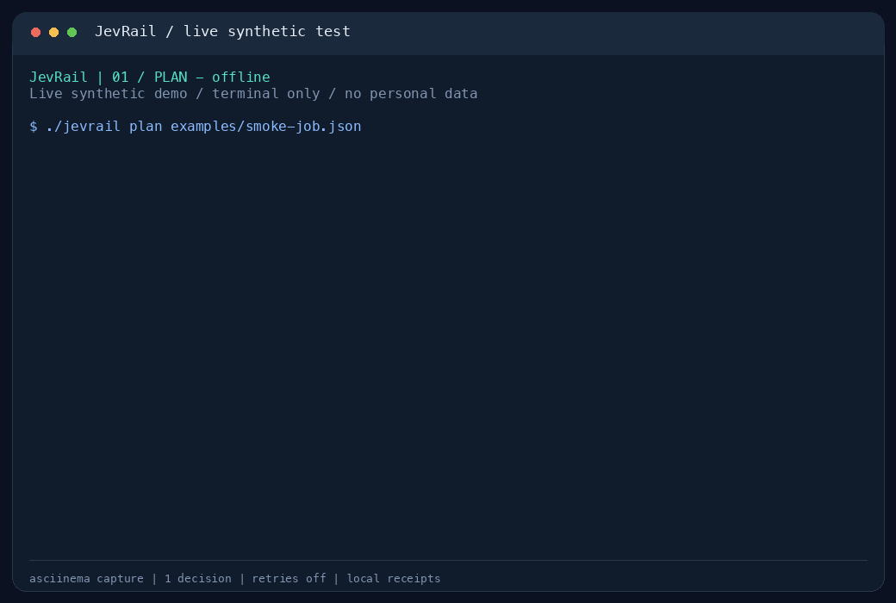

<p align="center"></p>

<p align="center"><strong>Every decision leaves a receipt.</strong><br>Inspectable Jev calls. Recorded costs. Conservative retries.</p>

<p align="center">English · <a href="README.zh-CN.md">简体中文</a><br>macOS first · TypeScript + Node.js · Zero runtime npm dependencies · MIT · Alpha</p>

## What this is

**Jev** is TypeSafe AI's System One decision model, designed for frequent, low-latency structured judgments: yes/no, classification and scoring, with probability or confidence information. Applications include content triage, text classification, label quality checks and scoring existing textual observations of media. See the [model reference](https://docs.typesafe.ai/models).

As checked on 2026-09-26, OpenRouter lists Jev 1.13 at **$0.042 per million input tokens, with free output**. Check the [model page](https://openrouter.ai/typesafe/jev-1.13) for current pricing. Latency depends on the request and network; JevRail has not run a large-scale performance benchmark.

**JevRail** is a small CLI for calling Jev through OpenRouter. Once a batch is running, you need to answer questions about individual decisions:

- Why was this record rated poorly? What did the model actually receive and return?
- A job stopped halfway through. Which items finished, and which costs still need reconciliation?
- What did the batch cost, and can each charge be traced to a call?

JevRail keeps the request, original provider response, model ID, cost and hashes together in local records, so a script or coding agent can show what actually happened.

You bring an OpenRouter key. JevRail reads it from macOS Keychain and calls OpenRouter directly. There is no project-operated relay, background server, account, telemetry or third-party runtime SDK.

This is an independent community client, not an official OpenRouter or TypeSafe product. Currently it supports Jev's typed decisions only, not general chat or media processing.

## Why this exists

Small AI jobs should be easy to inspect. Before trusting a batch, you should be able to answer:

- Where does the key go?
- What did the model receive and return?
- What was the reported cost?
- If the connection breaks, could a retry charge again?

JevRail makes those questions visible in source and local records. It does not claim that another tool is malicious or that a model's answer is true.

**Who it is for:** people running batches of decisions who need to review individual results and costs. Typical uses include content triage, label quality checks and scoring textual observations of media. Prepare media as text or structured observations first; JevRail does not read images, audio or video. Each job currently allows up to 500 items; prepare larger workloads in separate batches and validate their production behavior yourself.

For occasional calls, the [official SDK](https://openrouter.ai/docs/guides/community/typesafe-sdk) is a concise starting point. Use JevRail when you need saved receipts, cost records and conservative handling of interrupted jobs.

## Try it without a key

Download or clone this repository, then enter its directory. Use **Node.js 22.18+ within the 22.x line, or Node.js 24+**. Live credentials currently require macOS.

```sh
chmod +x ./jevrail
./jevrail --version
./jevrail plan examples/smoke-job.json
```

`plan` validates three synthetic examples locally. It does not read credentials, contact a provider or incur charges. A successful check prints `OFFLINE_PLAN`, the item count, model, request byte sizes and job hash for review before a run. It does not estimate tokens or cost. No `npm install` or build step is needed to run the CLI.



Actual `plan → run --max-items 1 → status` recording: synthetic input, one paid decision, retries disabled, reported cost **$0.000020160**. `plan` and `status` are offline; `run` requires credentials and is billable. Only the test terminal was recorded. [Recording notes and text transcript](docs/DEMO.md)

## Make a small live call

1. Run `./jevrail keychain-info` to see the expected **service and account selectors**. This does not access the secret.
2. In macOS Keychain Access, create a generic password using item name `jevrail.openrouter`, the displayed account, and your OpenRouter key as the password. Keep the key out of shell commands and job files.
3. Use an ordinary API key with a spending limit. Start with one synthetic item:

```sh
./jevrail key-status
./jevrail run examples/smoke-job.json --out runs/first-try \
  --max-items 1 --max-attempts 1 --budget-usd 0.01 --reserve-usd 0.002

# Resume the other two items using the same manifest and policy.
./jevrail run examples/smoke-job.json --out runs/first-try \
  --max-attempts 1 --budget-usd 0.01 --reserve-usd 0.002

# Read the saved summary offline.
./jevrail status runs/first-try
```

These `run` commands are **billable**. The `$0.01` value is a local scheduling budget, not a provider-enforced per-request cap. Actual pricing can change. When a response exceeds its reservation, the client records it and stops additional work. Keep a provider-side key limit as well.

An existing Keychain item can be selected with `--keychain-service NAME --keychain-account ACCOUNT`. These options accept identifiers, never the key itself. The CLI does not modify Keychain or discover other credentials automatically.

## Use with coding agents

One design goal is to let coding agents such as Codex and Claude Code run inspectable decision batches through the command line. No additional MCP server or Skill is needed: have the agent read this repository and the [calling contract](docs/CODEX.md). This describes a CLI interface, not a claim that every agent integration has been tested.

- **Recorded spending:** reserve against `--budget-usd` before dispatch. Insufficient budget blocks new requests; a response costing more than its reservation stops additional work. This is not a provider-enforced price ceiling; retain a provider-side key limit.
- **Reviewable behavior:** preserve request text, received provider response bytes and cost records. Keep the agent's interpretation separate from the original result.
- **Conservative recovery:** stop on timeout or an uncertain result for manual review. Only HTTP 429 may retry once; `--max-attempts 1` disables retries.

Start with an offline `plan`. Review the input, item count and proposed budget, then authorize `run`. These controls govern that CLI invocation; JevRail is not a sandbox for the agent's other actions.

## What is built in

| Capability | Behavior |
|---|---|
| Typed decisions | Validates `noul`, `choice`, `score`, question IDs, ranges, model, provider and usage. |
| Fixed destination | HTTPS to OpenRouter only; redirects rejected; ambient proxy and Node injection settings cleared by the launcher. |
| Conservative accounting | Reserve before dispatch; bounded concurrency; unknown costs retain reservations. |
| Resume | Check completed raw-response hashes; skip completed items without more decision calls. |
| Uncertain outcomes | Stop on timeout, interruption or invalid response. Do not automatically resend. |
| Rate limits | Only HTTP 429 can retry once; disable retries with `--max-attempts 1`. |
| Local receipts | Save exact response bytes separately from parsed results and interpretation. |
| Input guardrails | Block obvious secrets, contact details, URLs and common private paths. Business text requires explicit opt-in. |

```text
Your script / coding agent
          │
          ▼
      JevRail CLI ───── read credential ───── macOS Keychain
          │
          ├──── validate → reserve → persist
          │
          └──── HTTPS ──── OpenRouter ──── TypeSafe / Jev
          │
          ▼
   Private local receipts
   request · raw response · usage · hashes
```

The request body is sent to OpenRouter and its model provider. Original requests and results remain in the local output directory. Input filters are not a complete anonymizer; hashes are not signatures or proof of model accuracy. See [security boundaries](SECURITY.md).

## Receipts

```text
runs/first-try/
├── job.json
├── ledger.json
├── summary.json
└── <item-fingerprint>/attempt-1/
    ├── request.json
    ├── response.raw.json
    └── result.json
```

Output directories use mode `700`; files use `600`. `interpretation` is left empty so downstream commentary cannot be confused with a provider result. Runs are ignored by Git. Do not publish private receipts.

## Development

```sh
chmod +x ./jevrail
npm ci --ignore-scripts
npm run check
```

Development dependencies are locked. Tests use synthetic transports; CI needs no API secrets and makes no paid calls. Node's built-in TypeScript execution does not type-check; the check command runs TypeScript separately.

This is an **alpha**. Hosted checks passed on macOS and Linux. On 2026-09-26, the public version completed one live English synthetic case; the other two items were not run. It reused an existing Keychain item, so new-credential setup, large-batch performance and real media scoring remain unverified. See [validation scope](docs/VALIDATION.md).

## Learn more

- [CLI and job format](docs/USAGE.md)
- [Use with Codex or another coding agent](docs/CODEX.md)
- [Architecture and failure behavior](docs/ARCHITECTURE.md)
- [Security policy](SECURITY.md) · [Contributing](CONTRIBUTING.md) · [Roadmap](docs/ROADMAP.md)
- [OpenRouter's Jev documentation](https://openrouter.ai/docs/guides/community/jev-tutorial)

## License

[MIT](LICENSE). OpenRouter and TypeSafe names identify compatible services; their service terms and model access are separate from this code's license.
