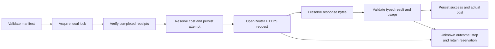

# Architecture

The supported boundary is the `jevrail` launcher plus four TypeScript modules:

| File | Responsibility |
|---|---|
| `src/cli.ts` | Parse commands, choose Keychain identifiers, validate job, check key limits, handle interruption. |
| `src/client.ts` | Read macOS Keychain, fixed-host HTTPS, timeout/response-size limits, suppress credential-like output. |
| `src/schema.ts` | Strict JSON parsing, input screening, canonical hashes, typed response validation, integer cost accounting. |
| `src/runner.ts` | Private storage, single-writer lock, persisted reservations, bounded workers, cache validation and ledger. |

The CLI is the supported public interface. Internal functions support transport injection for tests; they are not a stable SDK and should not be used to bypass the launcher's preparation or CLI data-authorization checks.

## Request lifecycle

Reservations are saved before awaiting network I/O. Every worker checks committed actual costs plus unknown reservations before dispatch. Amounts use integer nanodollars, rounding reported costs upward. A provider can still bill more than the local reservation; that stops additional scheduling.

A 429 may receive one explicitly bounded retry. Its unknown cost remains reserved even if the retry succeeds. Other uncertain outcomes are never automatically resent. The ledger and response files use atomic rename after file sync. This is designed for a trusted user and local filesystem, not a distributed transaction system.

No module walks a user's media library, calls a project relay, loads remote code, starts an MCP server, executes model output or automatically changes the model. The built-in `fetch` implementation and trusted Node runtime still remain part of the execution environment.
